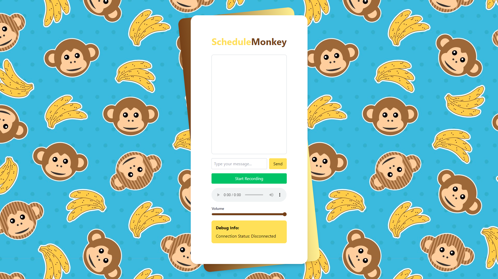

<h1 align="center">ScheduleMonkey</h1>

<h3 align="center">A open-source, voice-based AI application for easily setting Google Calendar events!</h3>

## Contact

Charlie Weinberger: [LinkedIn]() | [GitHub](https://github.com/charlieweinberger)
 
Mayank Tamakuwala: [LinkedIn](https://www.linkedin.com/in/mayanktamakuwala/) | [GitHub](https://github.com/MayankTamakuwala)
 
Michael Dang: [LinkedIn](https://www.linkedin.com/in/michael-v-dang/) | [GitHub](https://github.com/michaelvdang)
 
Byren Cheema: [LinkedIn](https://www.linkedin.com/in/byrencheema/) | [GitHub](https://github.com/byrencheema)
 
Berit Cheema: [LinkedIn](https://www.linkedin.com/in/berit-singh-cheema-851b10273/)
 

## Inspiration

Every day, 500 million people across the world use Google Calendar to schedule their days. But unless you have a Google smart home device, it's impossible to set events using only your voice. While manually creating an event or task may not seem like much, adding multiple events per day to schedule school, work, and personal responsibilities can add up. We set out to fix this problem by creating a service that can automatically schedule Google Calendar events with just your voice.

## How it works

To use ScheduleMonkey, start a voice recording and ask our AI model to create an event, and list the details of the event. If you don't wish to use your voice, you can always default back to typing a message instead. Once you send a message, it's translated from speech to text using OpenAI's open-source Whisper model. Then, Meta's open-source Llama 3.1 understands the message, uses Google Calendar's API to create your desired event, and generates a text response to return to you. Finally, Tortoise (also open source!) translates that text back into speech for you to hear a confirmation of your calendar event.

## Tracks

During this hackathon, we targeted the Retell AI and Magical Toys tracks, which we identified sharing key similarities that we could combine into one project.

## Tech Stack

#### Frontend

- Next.js w/ React - for creating a dynamic web application
- Typescript - for JavaScript type checking
- Tailwind CSS - for a beautiful yet simple UI design

#### Backend

- FastAPI w/ Python - for server-side logic and API endpoints
- Redis - for fast memory storage
- Firebase - for authentication and to store user's actions with Firestore
- Google Calendar API - for updating Google Calendar

#### AI/ML

- Whisper - for translating user speech into text (STT)
- Llama 3.1 - for analyzing user responses, calling the Google Calendar API, and generating a confirmation response
- Tortoise - for converting Llama's responses back into speech (TTS)

#### Deployment

- Vercel - for hosting our web application
- Brev - for deploying our AI model
- Docker - for containerizing our code

## Challenges we ran into

While building ScheduleMonkey, we ran into a number of challenges. The first challenge we encountered, which lasted for much of the hackathon, was properly configuring Tortoise to work, especially in conjunction with other aspects of our tech stack. We faced compatibility issues on all fronts, and tried many solutions before finally landing on one that worked with our entire stack. We also faced difficulty in downloading and training our AI model, since the computers we're working with aren't too powerful. Finally, we ran into issues with integrating different members' code together, but managed to push through using git and GitHub pull requests.

## Future improvements

In the future, we plan on expanding the reach of ScheduleMonkey beyond Google Calendar. We envision ScheduleMonkey being able to assist a wide array of secretary-like tasks, including sending emails, checking the weather, or controlling smart home devices. We know that the full potential of ScheduleMonkey is yet to be achieved!